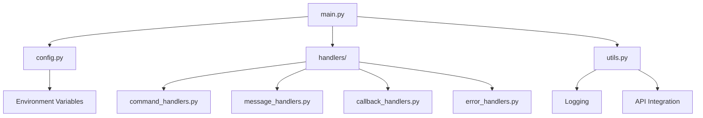

# 🤖 Telegram Bot

[](https://www.docker.com/)
[](https://python.org/)
[](https://telegram.org/)
[](https://opensource.org/licenses/MIT)
[](https://github.com/yourusername/telegram-bot)

Модульний Telegram бот з інтерактивним меню, Docker підтримкою та інтеграцією з зовнішніми API.

## 📦 Встановлення

### Клонування репозиторію

```bash
git clone https://github.com/yourusername/telegram-bot.git
cd telegram-bot
```

### Швидкий старт

```bash
# Локальний запуск
pip install -r requirements.txt
cp config.env .env  # Налаштуйте токен
python main.py

# Docker запуск
docker build -t telegram-bot .
docker run -d --name telegram-bot -e BOT_TOKEN="YOUR_BOT_TOKEN" telegram-bot
```

## 📋 Зміст

- [🚀 Швидкий старт](#-швидкий-старт)
- [🏗️ Архітектура](#️-архітектура)
- [🐳 Docker](#-docker)
- [🎭 Joke API](#-joke-api)
- [🔧 Налаштування](#-налаштування)
- [🛠️ Розробка](#️-розробка)
- [❓ Troubleshooting](#-troubleshooting)

## 🚀 Швидкий старт

### Локальний запуск

```bash
# 1. Клонування репозиторію
git clone <repository-url>
cd telegram-bot

# 2. Встановлення залежностей
pip install -r requirements.txt

# 3. Налаштування токена
cp config.env .env
# Відредагуйте .env файл з вашим токеном

# 4. Запуск
python main.py
```

### Docker запуск

```bash
# 1. Створення секрету
# BOT_TOKEN передається через змінну середовища

# 2. Збірка образу
docker build -t telegram-bot .

# 3. Запуск
docker run -d --name telegram-bot -e BOT_TOKEN="YOUR_BOT_TOKEN" telegram-bot
```

> 📖 **Детальні інструкції**: [QUICK_START.md](QUICK_START.md)

## 🏗️ Архітектура

### Структура проекту

```
telegram-bot/
├── 📁 handlers/              # Обробники подій
│   ├── command_handlers.py   # Команди (/start, /help, /joke)
│   ├── message_handlers.py   # Повідомлення користувачів
│   ├── callback_handlers.py  # Інтерактивні кнопки
│   └── error_handlers.py     # Обробка помилок
├── 📄 main.py               # Точка входу
├── 📄 config.py             # Конфігурація
├── 📄 utils.py              # Допоміжні функції
├── 🐳 Dockerfile            # Docker образ
├── 🐳 docker-compose.yml    # Docker Compose
└── 📄 requirements.txt      # Залежності
```

### Модульна архітектура



## 🐳 Docker

### Базовий запуск

```bash
# Створення секрету
# BOT_TOKEN передається через змінну середовища

# Збірка та запуск
docker build -t telegram-bot .
docker run -d --name telegram-bot -e BOT_TOKEN="YOUR_BOT_TOKEN" telegram-bot
```

### Docker Compose (рекомендовано)

```bash
# Створення .env файлу
cat > .env << EOF
BOT_NAME=My Telegram Bot
BOT_DEVELOPER=Your Name
LOG_LEVEL=INFO
EOF

# Запуск
docker-compose up -d
```

### Docker Swarm (продакшн)

```bash
# Ініціалізація
docker swarm init

# Створення секрету
# BOT_TOKEN передається через змінну середовища

# Запуск сервісу
docker service create \
  --name telegram-bot \
  -e BOT_TOKEN="YOUR_BOT_TOKEN" \
  --env BOT_NAME="Production Bot" \
  telegram-bot
```

> 📖 **Детальні приклади**: [docker-examples.md](docker-examples.md)

## 🎭 Joke API

### Налаштування зовнішнього API

```bash
# В config.env або як змінна середовища
JOKES_API_URL=http://joke-api:8080
JOKES_API_KEY=your_api_key_here  # опціонально
JOKES_API_TIMEOUT=15             # опціонально
```

### Підтримувані формати API

- **Setup/Punchline**: `{"setup": "Question?", "punchline": "Answer!"}`
- **Question/Answer**: `{"question": "Q?", "answer": "A!"}`
- **Content**: `{"title": "Title", "content": "Text"}`
- **Simple Text**: `{"text": "Joke text"}`

### Команди та кнопки

- **`/joke`** - Отримати випадковий жарт
- **🎭 Joke** - Кнопка в головному меню
- **🎭 Another Joke** - Для нового жарту

> 📖 **Детальна документація**: [JOKE_FEATURE.md](JOKE_FEATURE.md)  
> 🔧 **Налаштування API**: [API_SETUP.md](API_SETUP.md)

## 🔧 Налаштування

### Змінні середовища

| Змінна | Опис | Обов'язкова | За замовчуванням |
|--------|------|-------------|------------------|
| `BOT_TOKEN` | Токен Telegram бота | ✅ | - |
| `BOT_NAME` | Назва бота | ❌ | `Telegram Bot` |
| `BOT_VERSION` | Версія бота | ❌ | `1.0.0` |
| `BOT_DEVELOPER` | Розробник | ❌ | `Your Name` |
| `BOT_EMAIL` | Email розробника | ❌ | `your.email@example.com` |
| `LOG_LEVEL` | Рівень логування | ❌ | `INFO` |
| `JOKES_API_URL` | URL вашого API | ❌ | - |
| `JOKES_API_KEY` | API ключ | ❌ | - |

### Конфігурація для різних середовищ

#### Локальна розробка

```bash
# .env файл
BOT_TOKEN=your_development_token
BOT_NAME=Dev Bot
LOG_LEVEL=DEBUG
JOKES_API_URL=http://joke-api:8080
```

#### Docker

```bash
# Використання секретів
docker run -d \
  --name telegram-bot \
  -e BOT_TOKEN="YOUR_BOT_TOKEN" \
  -e BOT_NAME="Production Bot" \
  -e JOKES_API_URL="https://your-api.com/jokes/random" \
  telegram-bot
```

#### Kubernetes

```yaml
apiVersion: apps/v1
kind: Deployment
metadata:
  name: telegram-bot
spec:
  replicas: 1
  selector:
    matchLabels:
      app: telegram-bot
  template:
    metadata:
      labels:
        app: telegram-bot
    spec:
      containers:
      - name: telegram-bot
        image: telegram-bot:latest
        env:
        - name: BOT_TOKEN
          value: "YOUR_BOT_TOKEN"
        - name: BOT_NAME
          value: "Production Bot"
        - name: JOKES_API_URL
          value: "https://your-api.com"
        - name: JOKES_API_ENDPOINT
          value: "/api/getJoke"
```

## 🛠️ Розробка

### Встановлення для розробки

```bash
# Клонування
git clone <repository-url>
cd telegram-bot

# Віртуальне середовище
python -m venv venv
source venv/bin/activate  # Linux/Mac
# або
venv\Scripts\activate     # Windows

# Залежності
pip install -r requirements.txt

# Dev залежності
pip install pytest black flake8
```

### Розширення функціоналу

#### Додавання нових команд

1. Створіть функцію в `handlers/command_handlers.py`:

```python
async def new_command(update: Update, context: ContextTypes.DEFAULT_TYPE) -> None:
    """Нова команда"""
    await update.message.reply_text("Нова команда!")
```

2. Зареєструйте в `main.py`:

```python
application.add_handler(CommandHandler("new", new_command))
```

#### Додавання нових кнопок

1. Додайте обробник в `handlers/callback_handlers.py`:

```python
async def handle_new_callback(query):
    """Обробка нової кнопки"""
    await query.edit_message_text("Нова кнопка!")
```

2. Оновіть клавіатуру в відповідній функції.

### Тестування

```bash
# Запуск тестів
pytest

# Форматування коду
black .

# Перевірка стилю
flake8 .

# Перевірка типів
mypy .
```

### Структура тестів

```
tests/
├── test_handlers/
│   ├── test_command_handlers.py
│   ├── test_message_handlers.py
│   └── test_callback_handlers.py
├── test_config.py
├── test_utils.py
└── conftest.py
```

## ❓ Troubleshooting

### Часті проблеми

#### 1. Помилка "BOT_TOKEN is required"

```bash
# Перевірте наявність токена
echo $BOT_TOKEN

# Або для Docker
docker exec telegram-bot printenv BOT_TOKEN
```

#### 2. Контейнер не запускається

```bash
# Перевірте логи
docker logs telegram-bot

# Перевірте статус
docker ps -a
```

#### 3. Проблеми з Joke API

```bash
# Перевірте налаштування API
docker exec telegram-bot env | grep JOKES

# Тестування API
python test_joke.py
```

#### 4. Проблеми з мережею

```bash
# Перевірте мережеві налаштування
docker network ls
docker inspect telegram-bot
```

### Логування та діагностика

```bash
# Детальні логи
docker logs --details telegram-bot

# Логи в реальному часі
docker logs -f telegram-bot

# Вхід в контейнер
docker exec -it telegram-bot bash

# Перевірка змінних середовища
docker exec telegram-bot env | grep BOT
```

### Моніторинг продуктивності

```bash
# Використання ресурсів
docker stats telegram-bot

# Детальна інформація
docker inspect telegram-bot

# Мережева активність
docker exec telegram-bot netstat -tulpn
```

### Відновлення після збоїв

```bash
# Перезапуск контейнера
docker restart telegram-bot

# Перезапуск сервісу (Swarm)
docker service update telegram-bot

# Відновлення з бекапу
docker run -d --name telegram-bot-backup telegram-bot
```

## 📞 Підтримка

### Отримання допомоги

1. **Перевірте логи**: `docker logs telegram-bot`
2. **Перевірте конфігурацію**: `docker exec telegram-bot env`
3. **Перевірте статус**: `docker ps`
4. **Створіть issue** в репозиторії

### Корисні команди

```bash
# Швидкий діагноз
docker-compose logs --tail=50 telegram-bot

# Перевірка здоров'я
docker exec telegram-bot python -c "import config; print('OK')"

# Очищення ресурсів
docker system prune -f
```

---

## 📄 Ліцензія

MIT License - дивіться [LICENSE](LICENSE) файл для деталей.

## 🤝 Внесок

Ми вітаємо внески до проекту! Будь ласка, прочитайте [CONTRIBUTING.md](CONTRIBUTING.md) для деталей про наш код поведінки та процес надсилання pull requests.

### Швидкий внесок

1. Fork репозиторій
2. Створіть feature branch (`git checkout -b feature/amazing-feature`)
3. Commit зміни (`git commit -m 'Add amazing feature'`)
4. Push в branch (`git push origin feature/amazing-feature`)
5. Створіть Pull Request

### Звіти про помилки

Якщо ви знайшли помилку, будь ласка, створіть issue з детальним описом проблеми.

### Запити функцій

Ми вітаємо ідеї для нових функцій! Створіть issue з описом вашої ідеї.

---

**Розроблено з ❤️ для спільноти Telegram**